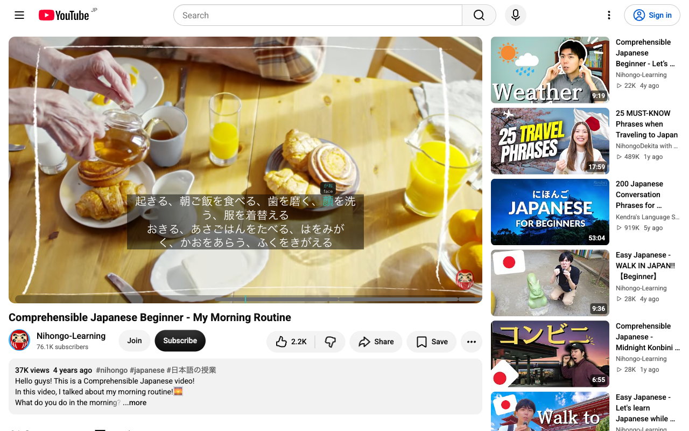
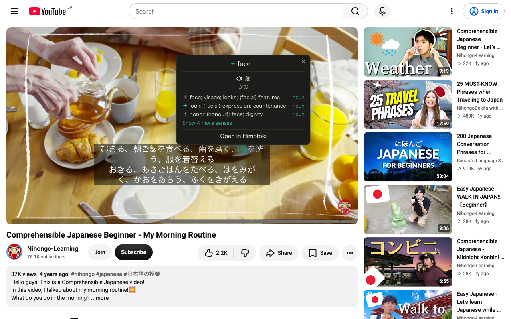

<h2 align="center">Himotoki Sub – learn Japanese from subtitles</h2>

Browser extension that turns the subtitles of YouTube, Netflix and other streaming sites into a Japanese study tool. Every subtitle line is split into words with a local model, and hovering or clicking a word opens a [Himotoki](https://himotoki.my.id) dictionary popup with readings, meanings, pitch accent, JLPT/frequency and grammar. Words can be saved to your Himotoki account or to Anki. Everything on the hover path runs on your device once the offline dictionary is installed. Japanese-only.

## Demo

| Furigana over the subtitles | Click a word for the dictionary |
| --- | --- |
|  |  |

## How it works

1. **Word splitting runs locally.** A character-level BiLSTM + CRF model (`public/models/default.onnx`, trained in [himotoki-split](https://github.com/msr2903/himotoki-split)) runs inside the extension through `onnxruntime-web` in an offscreen document. No text leaves the browser for segmentation. Until the model has run, cues are painted with `Intl.Segmenter` so subtitles appear instantly.
2. **Dictionary lookup is local.** On first use the extension popup offers to download a trimmed Jitendex database (about 38 MB compressed, 185 MB unpacked) into the browser's origin-private file system. Lookups then run in an extension worker with SQLite compiled to WebAssembly, including deinflection, and answer in a few milliseconds. Word lookup has no online fallback — until the dictionary is installed the popup prompts you to install it. (The dictionary file itself is a self-hosted GitHub release; see "Offline dictionary file".)
3. **Whole-line translation** is optional: clicking a subtitle line outside a word shows a machine translation of the full line via Google Translate or DeepL.
4. **Saving words.** Sign in with Google from the extension popup to save words (with the sentence, video URL and timestamp) to Himotoki favorites, or choose Anki in settings to send them to a local AnkiConnect (`http://localhost:8765`).

## Supported sites

YouTube, Netflix, KinoPub, Coursera, Plex, Udemy, Kinopoisk, Amazon Prime Video, inoriginal.online. On YouTube a Japanese caption track is preferred automatically when the video has one.

## Features

- **Local word splitting** with an instant `Intl.Segmenter` first paint.
- **Offline dictionary** (Jitendex, SQLite WebAssembly) with deinflection; online fallback until installed.
- **Configurable hover and click** — each can be furigana, meaning, furigana + meaning, pop-up dictionary, or nothing.
- **Dictionary pop-up** with senses, pitch accent, JLPT and frequency, an example, the deconjugation chain and an on-demand conjugation table, an entry switcher, word audio (speech synthesis + replay the line from the video), and save / mark-known.
- **Furigana** ruby over the kanji only; always/on-hover/never, and can be limited to words above a chosen JLPT level.
- **Colour words by JLPT difficulty**, and **dim known words** with per-video coverage and i+1 stats.
- **Dual subtitles** (a second track or a translation) and **whole-line translation** on click.
- **Reading & shadowing**: searchable transcript, sentence breakdown, replay/loop the current line, and arrow-key subtitle navigation.
- **Adjustable overlay** (size, background, delay, scale) and support for your own `.srt` / `.vtt`.

### Keyboard shortcuts
| Key | Action |
| --- | --- |
| `←` / `→` | Previous / next subtitle (`alt` + arrow forces the jump) |
| `D` | Cycle the second subtitle line |
| `R` | Replay the current line |
| `L` | Loop the current line (shadowing) |
| `B` | Toggle the sentence breakdown |
| `T` | Toggle the searchable transcript |
| `Esc` | Close a pinned pop-up |

### Mouse controls
The middle button and the two side buttons (back / forward) can each be set to previous line, next line, replay, loop, slow replay or play/pause, from the in-player panel or the settings page. They are off by default and only act while the pointer is over the video; elsewhere they keep their normal browser behaviour.

Settings live in the in-player panel, the full settings page (toolbar popup → Settings), and a welcome page on first install.

## Build

1. Install Node 20+ and pnpm.
2. `pnpm i`
3. `pnpm build` (Chrome) or `pnpm build:firefox`
4. Load the `dist/` folder as an unpacked extension (`chrome://extensions`, developer mode, "Load unpacked"). Reload the extension once after the first install so the `https://himotoki.my.id/*` host permission is granted.

`pnpm dev` starts a watch build with hot reload.

### Offline dictionary file

The extension downloads `jitendex-lite.sqlite.gz` from the URL in `src/shared/himotokiConfig.ts` (`HIMOTOKI_DICT_URL`, default the repo's own GitHub release: `https://github.com/msr2903/himotoki-sub/releases/latest/download/jitendex-lite.sqlite.gz`). It is self-hosted so the offline dictionary does not depend on himotoki.my.id. Build the file from a Jitendex SQLite and publish it as a release asset:

```bash
python3 scripts/build-dict.py /path/to/jitendex.sqlite dist-dict \
  --pitch pitch-kanjium.sqlite --freq freq-jpdb-v2.sqlite --jlpt jlpt.sqlite
# → dist-dict/jitendex-lite.sqlite.gz (+ .json manifest with revision and sha256)
gh release create dict-<revision> dist-dict/jitendex-lite.sqlite.gz dist-dict/jitendex-lite.json --latest
```

`latest/download` always resolves to the newest release, and a new release with a higher manifest `revision` triggers the in-app "update available" prompt.

All deployment-tied endpoints are runtime-configurable so a domain/backend move needs no rebuild: the **Advanced** section of the options page overrides the dictionary URL, the Convex URL (Save to Himotoki), and the Google OAuth client ID. Each falls back to the compiled default when left blank, and setting a custom dictionary/Convex URL requests host permission for that origin. The same values can be set directly as plain `chrome.storage.local` keys (`himotokiDictUrl`, `himotokiConvexUrl`, `himotokiGoogleClientId`) — the end-to-end scripts set `himotokiDictUrl` this way.

## Testing

```bash
pnpm test:unit                                  # Vitest unit tests (pure logic)
pnpm test                                        # deterministic Chromium regression checks
npx playwright install chromium
pnpm test:e2e                                    # YouTube: split, popup, settings, hotkeys
node scripts/e2e/dict.mjs /tmp/himotoki-dict     # offline dictionary: install, lookups, repair, persistence
HIMOTOKI_DICT_DIR=/tmp/himotoki-dict pnpm test:e2e   # YouTube with the offline dictionary installed
```

`tsc --noEmit`, `pnpm test:unit` and `pnpm build` also run in CI on every push and pull request.

> Firefox note: the local word splitter relies on `chrome.offscreen`, which Firefox does not implement. On Firefox the extension currently falls back to `Intl.Segmenter`.

## Using alongside Yomitan

Yomitan scans any text on the page, including this extension's subtitle overlay, so with both enabled you may see two pop-ups. Either add `youtube.com` (and the other video sites) to Yomitan's excluded sites, or set this extension's hover action to "No action" and keep click for the Himotoki pop-up.

## Contributing

Issues and pull requests are welcome. See [ROADMAP.md](./ROADMAP.md) for planned work, and please open an issue to discuss larger features before implementing them.

## Credits

Built on [EasySubs](https://github.com/Nitrino/easysubs) by Nitrino — this project is a Japanese-only fork that removes its multi-language features (Google word translation, phrasal verbs, English dictionaries, LinguaLeo, Puzzle English) and builds Japanese learning around the Himotoki dictionary and a local word splitter. Dictionary data from [Jitendex](https://jitendex.org/) (CC BY-SA 4.0), built from JMdict (EDRDG) with Tatoeba examples.
</content>
