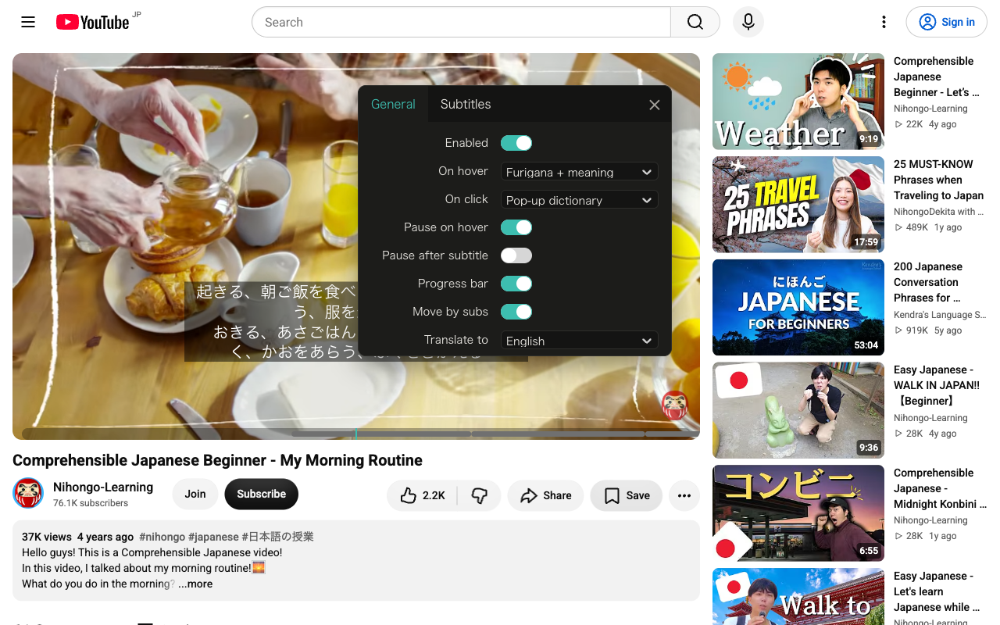
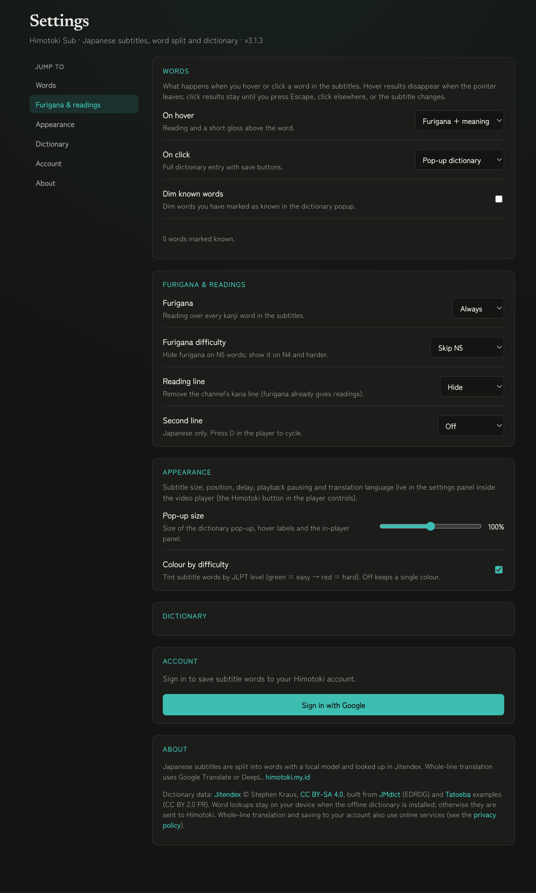

<p align="center">
  
</p>
<p align="center">
  <h2 align="center">Himotoki Sub – learn Japanese from subtitles</h2>
</p>

Browser extension that turns the subtitles of YouTube, Netflix and other streaming sites into a Japanese study tool. Every subtitle line is split into words with a local model, and hovering or clicking a word opens a [Himotoki](https://himotoki.my.id) dictionary popup with readings, meanings, pitch accent, JLPT/frequency and grammar. Words can be saved to your Himotoki account or to Anki. Everything on the hover path runs on your device once the offline dictionary is installed.

Forked from [EasySubs](https://github.com/Nitrino/easysubs). The multi-language features of EasySubs (Google word translation, phrasal verbs, English dictionaries, LinguaLeo, Puzzle English) have been removed; this project is Japanese-only.

## Demo

| Furigana over the subtitles | Click a word for the dictionary |
| --- | --- |
|  |  |

| In-player settings | Settings page |
| --- | --- |
|  |  |

## How it works

1. **Word splitting runs locally.** A character-level BiLSTM + CRF model (`public/models/default.onnx`, trained in [himotoki-split](https://github.com/msr2903/himotoki-split)) runs inside the extension through `onnxruntime-web` in an offscreen document. No text leaves the browser for segmentation. Until the model has run, cues are painted with `Intl.Segmenter` so subtitles appear instantly.
2. **Dictionary lookup is local.** On first use the extension popup offers to download a trimmed Jitendex database (about 38 MB compressed, 185 MB unpacked) into the browser's origin-private file system. Lookups then run in an extension worker with SQLite compiled to WebAssembly, including deinflection (the same rules engine as the Himotoki server), and answer in a few milliseconds. Until the dictionary is installed, words are looked up through `GET https://himotoki.my.id/api/search` and the popup says so.
3. **Whole-line translation** is optional: clicking a subtitle line outside a word shows a machine translation of the full line via Google Translate or DeepL, in the language chosen in settings.
4. **Saving words.** Sign in with Google from the extension popup to save words (with the sentence, video URL and timestamp) to Himotoki favorites, or choose Anki in settings to send them to a local AnkiConnect (`http://localhost:8765`).

## Supported sites

YouTube, Netflix, KinoPub, Coursera, Plex, Udemy, Kinopoisk, Amazon Prime Video, inoriginal.online. On YouTube a Japanese caption track is preferred automatically when the video has one.

## Features

### Subtitles and word splitting
- Japanese subtitles overlaid on the player, draggable, with adjustable size, background opacity and timing delay.
- Each line is split into words by the local model; whitespace and punctuation never reach the segmenter, and adjacent segments that form a dictionary headword are merged back together.
- Upload your own `.srt` / `.vtt` subtitles when a site has none.

### Hover and click on a word
- Hover and click are configured **separately** in the settings. Each can be **Furigana**, **Meaning**, **Furigana + meaning**, **Pop-up dictionary** or **No action**. Hover results vanish when the pointer leaves; click results stay pinned until Escape, a click elsewhere, or the next subtitle. Defaults: hover shows furigana + meaning, click pins the pop-up dictionary.
- The **dictionary pop-up** follows the himotoki.my.id entry card: headword and reading, numbered senses, **pitch-accent** diagram, **JLPT level** and **frequency** badges, an example sentence, and — for conjugated words — the **deconjugation chain** with an on-demand **conjugation table**. When several dictionary entries share a surface, a switcher pages between them.
- **Word audio**: a speaker button pronounces the headword with the browser's speech synthesis, and (in the pop-up) you can **replay the line's own audio** from the video for native pronunciation in context.
- **Save / Known**: save the word to Himotoki favorites or Anki, or mark it known, straight from the pop-up. Saving marks a word known automatically.

### Furigana and readings
- Inline **furigana** ruby sits **only over the kanji** (食べた → 食「た」べた); okurigana stays plain text. Show it over every kanji word, only the word under the pointer, or never.
- **Difficulty-aware furigana**: hide readings on words you already know by JLPT level (e.g. "Skip N5", up to "Only rare words"), so ruby appears only on harder vocabulary. Uses the JLPT data folded into the dictionary.
- **Reading line**: channels that print a kana reading line under the kanji line are detected — hide that duplicate (furigana replaces it) or keep it as text.

### Difficulty and known words
- **Colour by difficulty** (opt-in): tint each subtitle word by JLPT band, green (N5) → red (N1), so a line's difficulty reads at a glance.
- **Known words**: mark words known from the pop-up and optionally **dim** them so unknown words stand out. The in-player panel shows this video's **coverage** — how many distinct words it uses, how many you know, and how many **i+1** lines have exactly one new word.

### Reading, review and navigation
- **Searchable transcript** (`T`): every cue with its timestamp, filter by text, click a line to seek there.
- **Sentence breakdown** (`B`): a local, word-by-word view of the current line with readings and short glosses.
- **Dual subtitles**: a second line under the Japanese one — the video's own subtitle track in your "Translate to" language (on YouTube, its auto-translation when no such track exists), or a machine translation of the current line. Off by default; toggle in settings or press `d`.
- **Whole-line machine translation** on click outside a word (Google Translate or DeepL, with optional DeepL API key).
- **Shadowing**: replay the current line (`R`) or loop it (`L`); step to the previous/next/current subtitle with the arrow keys.
- **Playback pausing**: pause while hovering a word, or pause after every subtitle.
- Subtitle **progress bar** across the player.

### Saving
- Save words to **Himotoki favorites** (Convex backend, Google sign-in) with the sentence, video URL and timestamp, or to **Anki** via a local AnkiConnect.

### Keyboard shortcuts
| Key | Action |
| --- | --- |
| `←` / `→` | Previous / next subtitle (`alt` + arrow forces the jump) |
| `D` | Cycle the second subtitle line (off → track → translate) |
| `R` | Replay the current line |
| `L` | Loop the current line (shadowing) |
| `B` | Toggle the sentence breakdown |
| `T` | Toggle the searchable transcript |
| `Esc` | Close a pinned pop-up |

Settings live in three places: the in-player panel (the Himotoki button in the player controls), the full **settings page** (toolbar popup → Settings, or `chrome://extensions` → Details → Extension options), and a welcome page on first install.

## Build

1. Install Node 20+ and pnpm.
2. `pnpm i`
3. `pnpm build` (Chrome) or `pnpm build:firefox`
4. Load the `dist/` folder as an unpacked extension (`chrome://extensions`, developer mode, "Load unpacked"). Reload the extension once after the first install so the `https://himotoki.my.id/*` host permission is granted.

`pnpm dev` starts a watch build with hot reload.

### Offline dictionary file

The extension downloads `jitendex-lite.sqlite.gz` from the URL in `src/shared/himotokiConfig.ts` (`HIMOTOKI_DICT_URL`, default `https://himotoki.my.id/dicts/jitendex-lite.sqlite.gz`). Build that file from a Jitendex SQLite produced by himotoki-web-ts and upload it there:

```bash
python3 scripts/build-dict.py /path/to/himotoki-web-ts/data/dicts/jitendex.sqlite dist-dict
# → dist-dict/jitendex-lite.sqlite.gz (+ .json manifest with revision and sha256)
```

For local testing you can point the extension at any URL by setting `himotokiDictUrl` in `chrome.storage.local` (the end-to-end scripts do this).

## Testing

```bash
pnpm test:unit                                  # Vitest unit tests (pure logic: furigana, segmentation, mapping)
pnpm test                                        # deterministic Chromium regression checks
npx playwright install chromium
pnpm test:e2e                                    # YouTube: split, popup, settings, hotkeys
node scripts/e2e/dict.mjs /tmp/himotoki-dict     # offline dictionary: install, lookups, repair, persistence
HIMOTOKI_DICT_DIR=/tmp/himotoki-dict pnpm test:e2e   # YouTube with the offline dictionary installed
```

`tsc --noEmit`, `pnpm test:unit` and `pnpm build` also run in CI on every push and pull request.

> Firefox note: the local word splitter relies on `chrome.offscreen`, which Firefox does not implement. On Firefox the extension currently falls back to `Intl.Segmenter`.

## Using alongside Yomitan

Yomitan scans any text on the page, including this extension's subtitle overlay, so with both enabled you may see two pop-ups. Either add `youtube.com` (and the other video sites) to Yomitan's excluded sites, or set this extension's hover action to "No action" and keep click for the Himotoki pop-up.

## Manual QA before a release

Automated checks cover Playwright's Chromium; do this once in your real Chrome profile:

1. Load `dist/` unpacked, reload once (host permission), open a video with Japanese captions.
2. Hover several adjacent words: labels must follow the pointer without flicker.
3. Click a word: pop-up pins, stays while the pointer leaves, closes on Escape.
4. Settings page: download the dictionary, then confirm the "Online lookup" footer disappears.
5. With Yomitan enabled, confirm only one pop-up appears (see above).
6. Sign in, save a word, check it on himotoki.my.id.

## Contributing

Issues and pull requests are welcome. See [ROADMAP.md](./ROADMAP.md) for planned work, and please open an issue to discuss larger features before implementing them.
</content>
